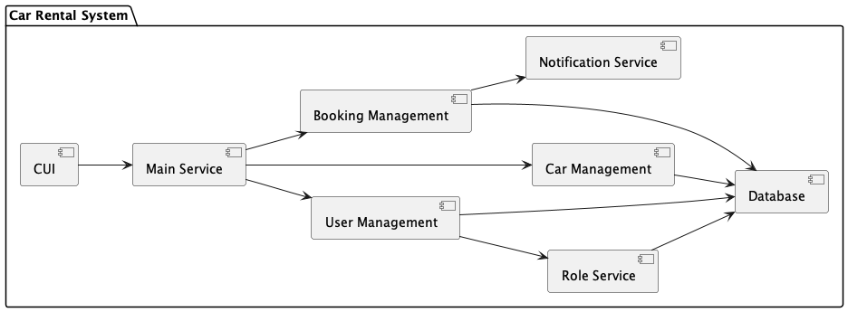
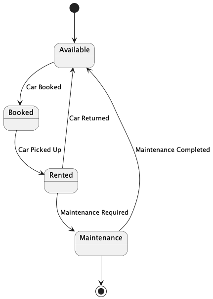

# MSE800 Assessment 1 - README
## User Documentation

### 1. Project Setup

1. **Clone the Repository:**
   - Clone the project repository from GitHub using the following URL:
     ```bash
     git clone https://github.com/lumax2/MSE_800_Assignment_1.git
     ```

2. **Install Dependencies:**
   - Ensure you have Python installed on your system.
   - Navigate to the project directory and install the required dependencies using:
     ```bash
     pip install -r requirements.txt
     ```

### 2. Configuration

1. **Database Configuration:**
   - The project uses a MySQL database hosted on Google Cloud. Configure the database connection in the `config.ini` file located in the project root:
     ```ini
     [mysql]
     host = rm-uf6wz9309g448ly67no.mysql.rds.aliyuncs.com
     port = 3306
     database = MSE800
     user = chenghao
     encrypted_password =gAAAAABm7lDveEoiAYFwXOrNnGcrLGPAAzVur5KBmg2bj_EoFczIrjZEoBBJFWVs3wYXV-ihZJ-b1-19St_-9IWbdPal9_SfZg==
     DB_KEY=L3tLdmglGKFdIeYe9xHLPa_ebkN3TX-NVZGK79ExoQk=
     ```

2. **Initialize Mock Data:**
   - To initialize the database with mock data, execute the SQL scripts provided in the `test/mock_data/test_data.sql` file. This will populate the database with:
     - 200 booking records
     - 20 cars
     - 20 customers
     - 1 admin with credentials: `username: admin`, `password: admin`

### 3. System Features

Refer to the [system_documentation.md](readme/system_doc/system_documentation.md) for a detailed list of system functionalities, including:

- **User Management:** Registration, login, and role-based access control.
- **Car Management:** Add, update, delete, and view car details.
- **Booking Management:** Book cars, view rental history, and manage bookings.
- **Admin Features:** Approve or deny bookings, manage users and cars.

### 4. Compliance with Requirements

The system design and documentation adhere strictly to the requirements outlined by the instructor. For detailed assessment requirements and marking rubric, refer to the [assessment_requirement.md](readme/requirement/assessment_requirement.md).

### 5. Additional Resources

- **GitHub Repository:** [MSE_800_Assignment_1](https://github.com/lumax2/MSE_800_Assignment_1.git)
- **Design and Architecture Documentation:** Includes UML diagrams such as Class, Use Case, and Sequence diagrams.

This documentation provides a comprehensive guide to setting up and understanding the Car Rental System, ensuring users can effectively initiate and utilize the project.

## System Documentation
[system_documentation.md](readme/system_doc/system_documentation.md)  

## Table of Contents
1. [GitHub Repository URL](#github-repository-url)
2. [Task 1 - Design and Architecture (LO1)](#task-1---design-and-architecture-lo1)
   - [1.1 Module Function Design](#11-module-function-design)
   - [1.2 Structure Diagram](#12-structure-diagram)
   - [1.3 Behaviour Diagram](#13-behaviour-diagram)
   - [1.4 Interaction Diagram](#14-interaction-diagram)
   - [1.5 Database ER Diagram](#15-database-er-diagram)
   - [1.6 Design Patterns](#16-design-patterns)
3. [Task 2 - Implementation of Innovative Feature (LO2)](#task-2---implementation-of-innovative-feature-lo2)
   - [Overview](#overview)
   - [Features](#features)
     - [1. User-Level Rental Data Statistics](#1-user-level-rental-data-statistics)
     - [2. Vehicle-Level Rental Data Statistics](#2-vehicle-level-rental-data-statistics)
     - [3. Machine Learning Integration](#3-machine-learning-integration)
   - [Competitive Advantage](#competitive-advantage)
   - [Technology Stack](#technology-stack)
   - [Future Enhancements](#future-enhancements)
4. [Task 3 - Software Evolution Implementation Plan](#task-3---software-evolution-implementation-plan)
   - [Overview](#overview-1)
   - [1. Version Control and Release Management](#1-version-control-and-release-management)
     - [1.1 Versioning Strategy](#11-versioning-strategy)
     - [1.2 Branching Strategy](#12-branching-strategy)
     - [1.3 Release Strategy](#13-release-strategy)
   - [2. Issue Tracking and Maintenance](#2-issue-tracking-and-maintenance)
     - [2.1 GitHub Issues Management](#21-github-issues-management)
     - [2.2 Code Quality and Refactoring](#22-code-quality-and-refactoring)
     - [2.3 Documentation Updates and Maintenance](#23-documentation-updates-and-maintenance)
   - [3. Software Evolution and Team Development](#3-software-evolution-and-team-development)
     - [3.1 Preparing for Modular Development](#31-preparing-for-modular-development)
     - [3.2 Future Team Collaboration](#32-future-team-collaboration)
   - [4. Long-Term Strategy and Expansion](#4-long-term-strategy-and-expansion)
     - [4.1 Gradual Expansion](#41-gradual-expansion)
     - [4.2 Community and Feedback](#42-community-and-feedback)
   - [Conclusion](#conclusion)

### GitHub Repository URL
- [https://github.com/lumax2/MSE_800_Assignment_1.git](https://github.com/lumax2/MSE_800_Assignment_1.git)

### Task 1: Design and Architecture (LO1)
#### 1.1 Module Function Design
- **1.1.1 Function Design**  
  
- **1.1.2 Module Design**  
  

#### 1.2 Structure Diagram
- **1.2.1 Package Diagram**
  
- **1.2.2 Class Diagram**  
  
- **1.2.3 Component Diagram**  
  
- **1.2.4 Object Diagram**  
  
- **1.2.5 Composite Structure Diagram**  
  

#### 1.3 Behaviour Diagram
- **1.3.1 Activity Diagram**  
  
- **1.3.2 Use Case Diagram**  
  
- **1.3.3 Use Case Full Description**  
  1. [Register Use Case](readme/system_doc/uml/behaviour_diagram/use_case_full_description.md#register-use-case)  
  2. [Login Use Case](readme/system_doc/uml/behaviour_diagram/use_case_full_description.md#login-use-case)  
  3. [View Available Cars Use Case](readme/system_doc/uml/behaviour_diagram/use_case_full_description.md#view-available-cars-use-case)  
  4. [Book Car Use Case](readme/system_doc/uml/behaviour_diagram/use_case_full_description.md#book-car-use-case)  
  5. [View Rental History Use Case](readme/system_doc/uml/behaviour_diagram/use_case_full_description.md#view-rental-history-use-case)  
  6. [Manage Cars Use Case](readme/system_doc/uml/behaviour_diagram/use_case_full_description.md#manage-cars-use-case)  
  7. [Manage Users Use Case](readme/system_doc/uml/behaviour_diagram/use_case_full_description.md#manage-users-use-case)  
  8. [Manage Rentals Use Case](readme/system_doc/uml/behaviour_diagram/use_case_full_description.md#manage-rentals-use-case)  
  9. [View Current User Info Use Case](readme/system_doc/uml/behaviour_diagram/use_case_full_description.md#view-current-user-info-use-case)  
  10. [View Car Details Use Case](readme/system_doc/uml/behaviour_diagram/use_case_full_description.md#view-car-details-use-case)  
  11. [Search Cars Use Case](readme/system_doc/uml/behaviour_diagram/use_case_full_description.md#search-cars-use-case)  
  12. [Select Rental Dates Use Case](readme/system_doc/uml/behaviour_diagram/use_case_full_description.md#select-rental-dates-use-case)  
  13. [Confirm Booking Use Case](readme/system_doc/uml/behaviour_diagram/use_case_full_description.md#confirm-booking-use-case)  
  14. [Approve Booking Use Case](readme/system_doc/uml/behaviour_diagram/use_case_full_description.md#approve-booking-use-case)  
  15. [Deny Booking Use Case](readme/system_doc/uml/behaviour_diagram/use_case_full_description.md#deny-booking-use-case)  
  16. [View Booking Details Use Case](readme/system_doc/uml/behaviour_diagram/use_case_full_description.md#view-booking-details-use-case)  
  17. [Add Car Use Case](readme/system_doc/uml/behaviour_diagram/use_case_full_description.md#add-car-use-case)  
  18. [Update Car Use Case](readme/system_doc/uml/behaviour_diagram/use_case_full_description.md#update-car-use-case)  
  19. [Delete Car Use Case](readme/system_doc/uml/behaviour_diagram/use_case_full_description.md#delete-car-use-case)  
  20. [Add User Use Case](readme/system_doc/uml/behaviour_diagram/use_case_full_description.md#add-user-use-case)  
  21. [Update User Use Case](readme/system_doc/uml/behaviour_diagram/use_case_full_description.md#update-user-use-case)  
  22. [Delete User Use Case](readme/system_doc/uml/behaviour_diagram/use_case_full_description.md#delete-user-use-case)  
  23. [View User Details Use Case](readme/system_doc/uml/behaviour_diagram/use_case_full_description.md#view-user-details-use-case)

- **1.3.4 State Machine Diagram**  
    
    
  

#### 1.4 Interaction Diagram
- **1.4.1 Sequence Diagram**  
  
  - **Booking Sequence Diagram**  
    
  - **Booking Timing Diagram**  
    
  - **Booking Communication Diagram**  
    

#### 1.5 Database ER Diagram


#### 1.6 Design Patterns
- **1.6.1 Get the singleton instance of the database connection**
```
class DatabaseConnection:
    _instance = None

    def __new__(cls):
        if cls._instance is None:
            cls._instance = super(DatabaseConnection, cls).__new__(cls)
            cls._instance._connection = None
        return cls._instance

    def create_connection(self):
        """Create a database connection to the MySQL database."""
        if self._connection is None or not self._connection.is_connected():
            try:
                # Read configuration
                config = configparser.ConfigParser()
                config.read('config.ini')

                # Get database configuration
                db_config = config['mysql']
                self._connection = mysql.connector.connect(
                    host=db_config['host'],
                    port=int(db_config['port']),
                    database=db_config['database'],
                    user=db_config['user'],
                    password=db_config['password']
                )
                if self._connection.is_connected():
                    print("Connection to MySQL database is successful")
            except Error as e:
                print(f"Error: '{e}'")
                self._connection = None
        return self._connection

    def close_connection(self):
        """Close the database connection."""
        if self._connection and self._connection.is_connected():
            self._connection.close()
            print("MySQL connection is closed")
            self._connection = None

```
### Task 2 - Implementation of Innovative Feature (LO2)

#### Overview
The Car Rental System has been enhanced with advanced statistical functions and machine learning techniques to provide data-driven insights and intelligent decision-making for administrators.

#### Features

##### 1. User-Level Rental Data Statistics
- **Objective**: Classify users based on rental behavior.
- **Implementation**: 
  - Collects user rental data (frequency, duration, payment history).
  - Applies machine learning algorithms to categorize users (e.g., frequent renters, occasional renters).
  - Generates reports for targeted marketing and loyalty programs.

##### 2. Vehicle-Level Rental Data Statistics
- **Objective**: Classify vehicles based on usage patterns and maintenance needs.
- **Implementation**: 
  - Tracks vehicle usage data (rentals, mileage, maintenance).
  - Uses machine learning to classify vehicles (e.g., high-demand, low-demand).
  - Provides insights for fleet management.

##### 3. Machine Learning Integration
- **Objective**: Enhance decision-making capabilities.
- **Implementation**:
  - Utilizes supervised learning (e.g., decision trees) for user and vehicle classification.
  - Continuously improves model accuracy with new data.

#### Competitive Advantage
- **Personalized User Experience**: Tailored marketing and offers.
- **Optimized Fleet Management**: Efficient vehicle maintenance and availability.
- **Intelligent Decision Support**: Data-driven insights for better business decisions.

#### Technology Stack
- **Programming Language**: Python
- **Machine Learning Libraries**: Scikit-learn, Pandas, NumPy
- **Database**: MySQL
- **Visualization**: Matplotlib, Seaborn

#### Future Enhancements
- **Real-Time Analytics**: Implement real-time data processing.
- **Enhanced Models**: Experiment with advanced machine learning models.
- **User Feedback Loop**: Integrate feedback to improve classification accuracy.

### Task 3 - Software Evolution Implementation Plan

#### Overview
This plan describes how to manage software versions using GitHub+Git, including versioning strategy, branching strategy, and release strategy. Additionally, it outlines the use of GitHub Issues for tracking development and fixing issues, conducting refactoring and documentation updates through unit testing and code review, with a focus on enhancing the README and related development documentation. As the project evolves, this plan also prepares for future team-based and modular development.

#### 1. Version Control and Release Management

##### 1.1 Versioning Strategy
- **Semantic Versioning**: Use semantic versioning (e.g., v1.0.0) to manage project versions.
  - **MAJOR version**: Incremented when incompatible API changes or major new features are introduced.
  - **MINOR version**: Incremented when adding backward-compatible functionality.
  - **PATCH version**: Incremented when fixing backward-compatible bugs.

##### 1.2 Branching Strategy
- **Main Branch**: The current stable version of the personal project, which will continue as the mainline as team development progresses.
- **Feature Branches**: Create separate branches for each new feature, which are merged into the Main Branch after development and testing.
- **Hotfix Branches**: Used for fixing urgent issues, merged into the Main Branch upon completion.

##### 1.3 Release Strategy
- **Personal Project Releases**: Release a new version after completing a significant feature or fix, documenting version changes.
- **GitHub Releases**: Use GitHub Releases to manage project versions and publish detailed release notes.
- **Continuous Integration**: Integrate simple CI processes (e.g., GitHub Actions) to ensure that code is automatically built and basic tests are run with each commit.

#### 2. Issue Tracking and Maintenance

##### 2.1 GitHub Issues Management
- **Issue Tracking**: Use GitHub Issues to record issues, bug fixes, and feature requests during project development.
  - **Labels**: Apply labels (e.g., bug, enhancement) to categorize issues for easier management.
  - **Milestones**: Assign issues to version milestones to plan and track progress.

##### 2.2 Code Quality and Refactoring
- **Unit Testing**: Write unit tests for critical features to ensure stability during subsequent iterations.
  - **Automated Testing**: Use GitHub Actions to automatically run unit tests, ensuring code quality with each commit.
- **Code Review**: Conduct code reviews through Pull Requests to ensure code quality and consistency.
  - **Review Process**: Require at least one developer to review each Pull Request, resolving all review comments before merging.
- **Code Refactoring**: Regularly refactor code to improve readability and maintainability, preparing for future team collaboration.

##### 2.3 Documentation Updates and Maintenance
- **Enhance README**: Keep the README detailed and up-to-date, including project overview, installation guide, usage instructions, and contribution guidelines.
- **Development Documentation**: Ensure that the development documentation accurately records the system architecture, API interfaces, and design decisions, providing clear references for future team members.

#### 3. Software Evolution and Team Development

##### 3.1 Preparing for Modular Development
- **Modular Design**: Begin implementing modular design during personal development, enabling future team members to independently develop different modules.
- **Code Layering**: Introduce a layered architecture (e.g., UI layer, service layer, data access layer) to improve system scalability and maintainability.

##### 3.2 Future Team Collaboration
- **Branch Naming Conventions**: Establish branch naming conventions to provide clear guidance for future team collaboration.
- **Communication Tools**: Start using collaboration tools (e.g., GitHub Projects, Slack) for team communication and task management.
- **Continuous Integration and Delivery**: Gradually enhance CI/CD processes to ensure smooth integration and deployment during team development.

#### 4. Long-Term Strategy and Expansion

##### 4.1 Gradual Expansion
- **From Personal to Team Development**: Initially focus on personal development, gradually involving more developers through iterations, and eventually forming team collaboration.
- **Technical Debt Management**: Regularly identify and clean up technical debt to ensure healthy project growth during expansion.
- **New Technology Adoption**: Evaluate and adopt new technologies as the team expands and the project evolves to keep the project technically advanced.

##### 4.2 Community and Feedback
- **User and Developer Community**: Engage with users and developers through GitHub Discussions or Issues to collect feedback and guide project iterations.
- **Security and Maintenance**: Regularly perform security audits and dependency updates to ensure project security and stability.

#### Conclusion
Through the above strategies, the Car Rental System will be able to adapt to changes, continuously evolve, and maintain high quality, stability, and security. This plan ensures the long-term success of the system and allows it to remain competitive in a rapidly changing technological environment.


## Assessment Requirements and Marking Rubric
[assessment_requirement.md](readme/requirement/assessment_requirement.md)
