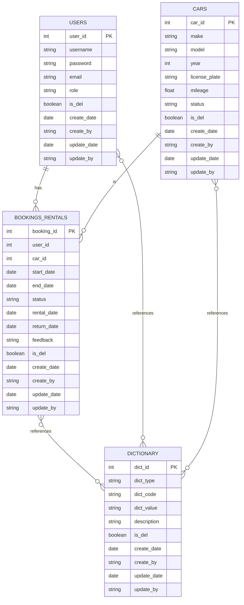

```mermaid
erDiagram
    USERS {
        int user_id PK
        string username
        string password
        string email
        string role
        boolean is_del
        date create_date
        string create_by
        date update_date
        string update_by
    }
    
    CARS {
        int car_id PK
        string make
        string model
        int year
        string license_plate
        float mileage
        string status
        boolean is_del
        date create_date
        string create_by
        date update_date
        string update_by
    }

    BOOKINGS_RENTALS {
        int booking_id PK
        int user_id 
        int car_id 
        date start_date
        date end_date
        string status
        date rental_date
        date return_date
        string feedback
        boolean is_del
        date create_date
        string create_by
        date update_date
        string update_by
    }

    DICTIONARY {
        int dict_id PK
        string dict_type
        string dict_code
        string dict_value
        string description
        boolean is_del
        date create_date
        string create_by
        date update_date
        string update_by
    }

    USERS ||--o{ BOOKINGS_RENTALS : "has"
    CARS ||--o{ BOOKINGS_RENTALS : "is"
    BOOKINGS_RENTALS }o--o{ DICTIONARY : "references"
    USERS }o--o{ DICTIONARY : "references"
    CARS }o--o{ DICTIONARY : "references"
```